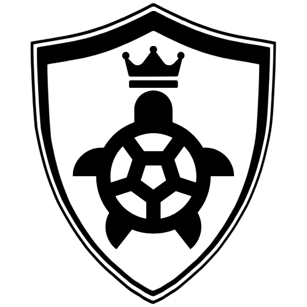

# TurtleBoss 

TurtleBoss is the output of the course Laboratory of robotics - B3B33LAR at Department of Cybernetics at CTU FEE.

This project deals with the control of the TurtleBot robot and specifically the second task Robot scores goal, for more see: https://cw.fel.cvut.cz/wiki/courses/b3b33lar/tasks/scoregoal_cs.

---

## 🚀 Getting Started

---

### Requirements

- Python 3.11
- OpenCV 4.11
